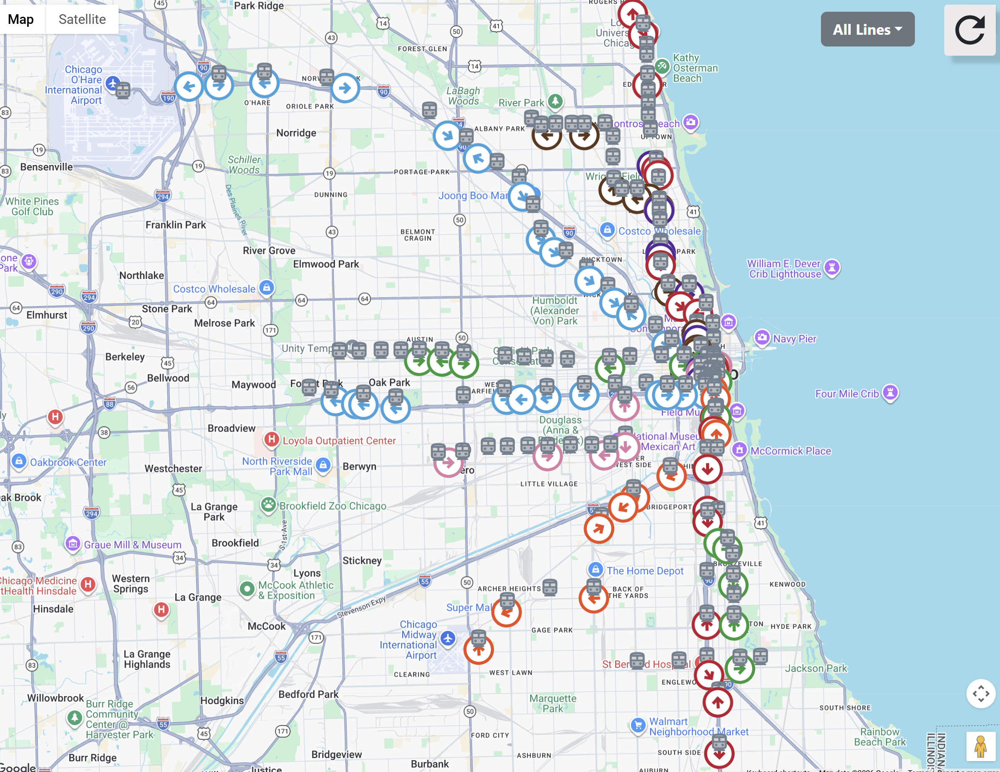
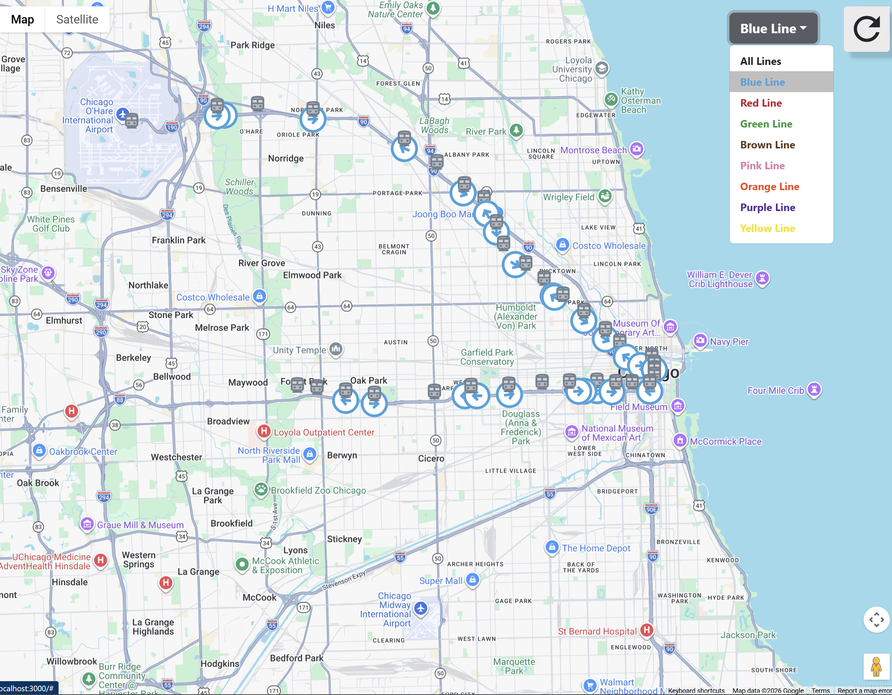
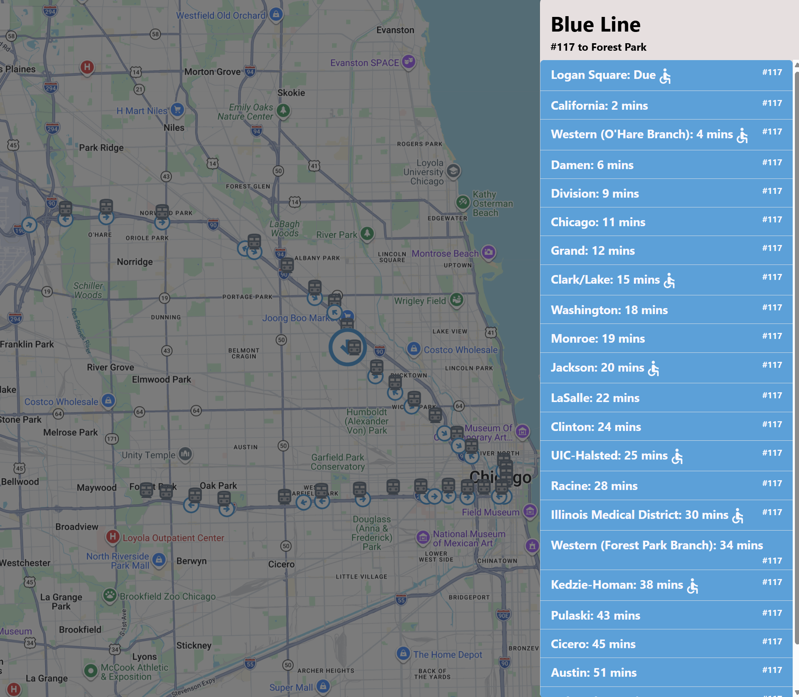
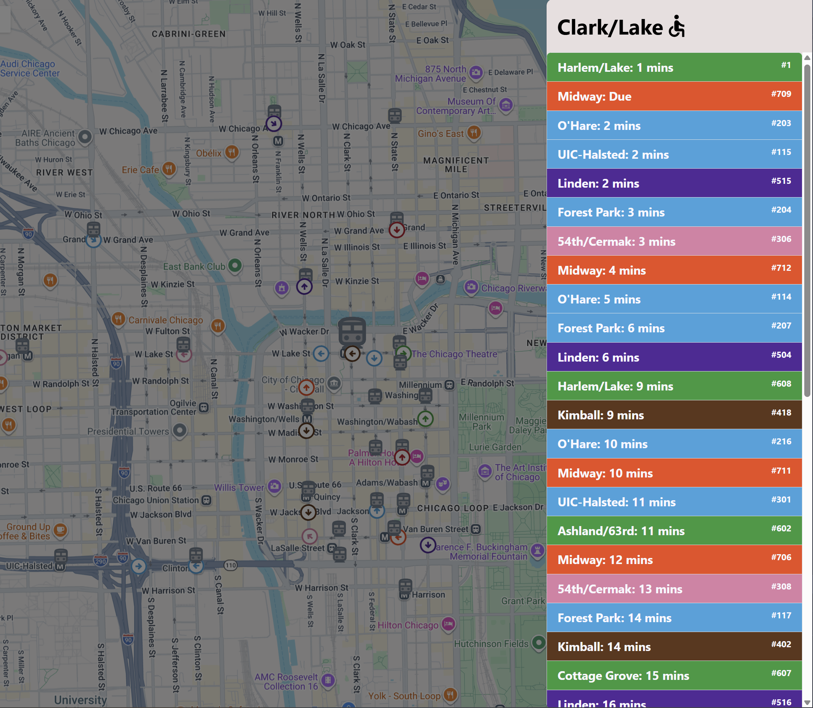

# CTA Tracker by James Geary
### A personal project

---

## Setup
Required vars in `.env.local` file in root directory:
- `REACT_APP_GOOGLE_MAPS_API_KEY`: a Google Maps API key
- `CTA_API_KEY`: a [CTA Train Tracker API](https://www.transitchicago.com/developers/traintracker/) key

## Starting up

`npm install` then `npm start`. This will start the frontend app at `localhost:3000` the Apollo server at `localhost:4000`

All CTA lines and stations

Selecting a train line

Selecting a train run

Selecting a station

TODO: Add accessible filtering. Add unit testing suite.

Credit: this project was bootstrapped with [Create React App](https://github.com/facebook/create-react-app).
